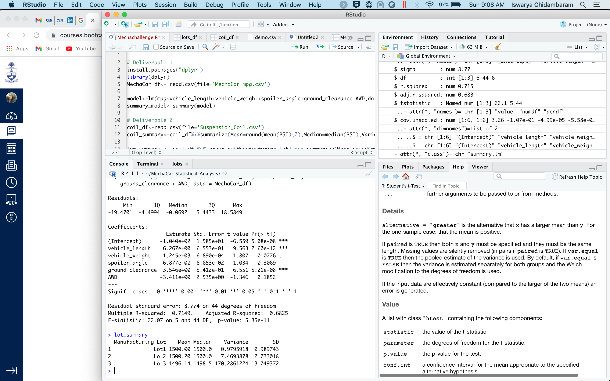
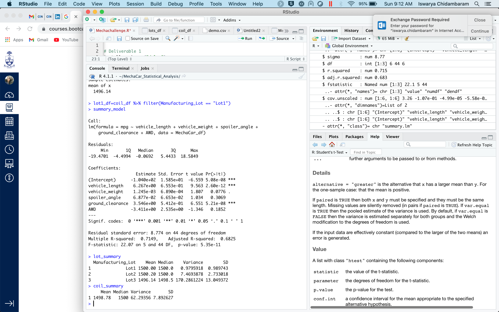
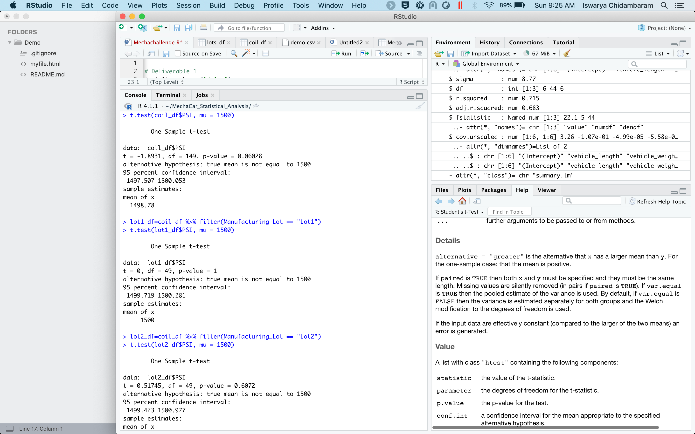
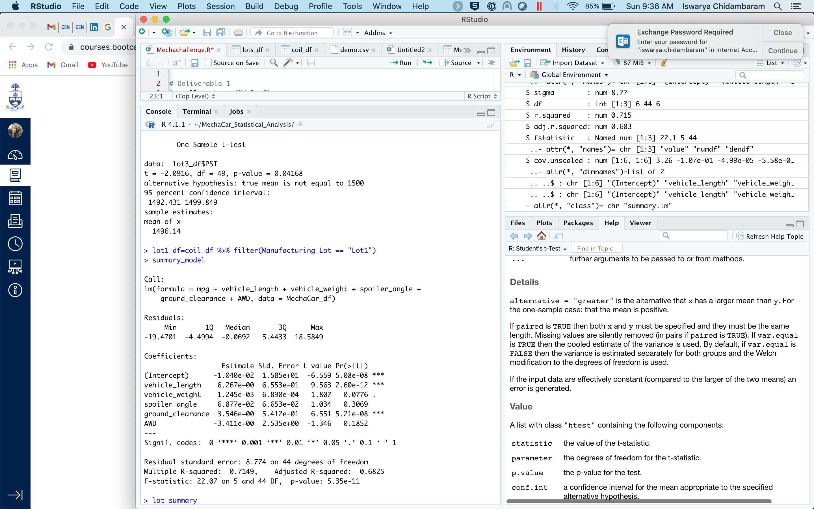

# MechaCar_Statistical_Analysis
## Summary Statistics on Suspension Coils

Leveraging the summarize function in R we can find out the mean,median,variance and SD of a dataset. From this calculation of thos dataset we can find that mean is almost close to the median value of 1500.

Lot summary gives the value of mean , median, variance and SD for all the 3 lots and compare the weight capacities of multiple suspension coils were tested to determine if the manufacturing process is consistent across production lots.

###Question:

The design specifications for the MechaCar suspension coils dictate that the variance of the suspension coils must not exceed 100 pounds per square inch. Does the current manufacturing data meet this design specification for all manufacturing lots in total and each lot individually? Why or why not?

The variance of the suspension coil is as per the design specification in lot 1 and lot 2 whereas in lot 3, it is higher.

## T-Tests on Suspension Coils

From the  knowledge of R, t-tests is performed to determine if all manufacturing lots and each lot individually are statistically different from the population mean of 1,500 pounds per square inch. We can see that true mean is not equal to 1500 and the actual mean is 1498.78

## Linear Regression to Predict MPG

Vehicle_length and ground_clearance provided a non-random amount of variance to the mpg values in the dataset
Intercept is not equal to 0. This linear model predicts the  mpg of MechaCar prototypes effectively as we can see that as it has a  p-value: 5.35e-11

## Study Design: MechaCar vs Competition

1.MechaCar performs analysis beased on vehicle_length, vehicle_weight,spoiler_angle,ground_clearance and AWD. 
2.We can find the Vehicle_length and ground_clearance provided a non-random amount of variance to the mpg values in the dataset.
3.Vehicle_lenth and ground_clearnace affect the cost and highway fuel efficiency than the other cars. We can find that with this R script.

We are going to test PSI and vehicle_length with other competitiors.
The alternative hypothesis from this datset eauals that true mean is not equal to 1500.
We can do T -Test to test the hypothesis as we an see how the mean is skewed from the dataset and if the error is close to 1.
To run the statistical set, we run the whole dataset and we need Mu to run the statistical analysis.

